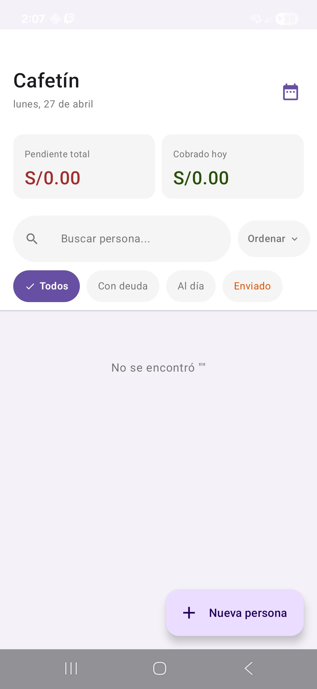
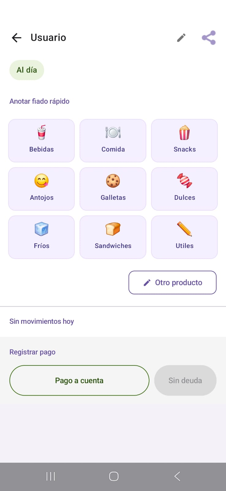
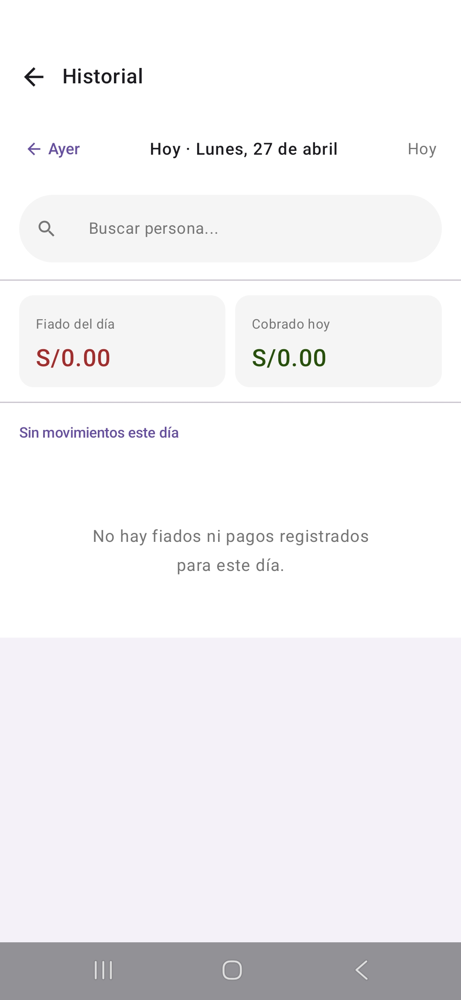
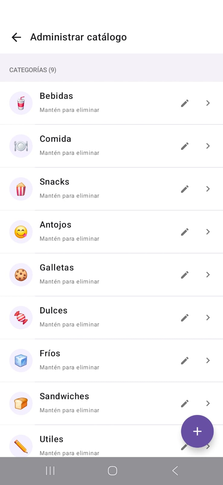

# ☕ Cafetín — Gestión de fiados


App Android para gestionar fiados en una cafetería escolar. Reemplaza el cuaderno y el bolígrafo: registra deudas, cobra pagos y exporta reportes en PDF — todo sin internet. Ahora también sincroniza datos con un servidor remoto y permite hacer respaldos locales.

> **Impacto real:** el negocio pasó de llevar las cuentas a mano (varias horas al día) a registrar cada fiado en segundos.

---

## 📸 Capturas de pantalla

| Clientes | Detalle | Historial | Catálogo |
|----------|---------|-----------|----------|
| | | | |

---

## ✨ Funcionalidades

- **Registro rápido de fiados** por categorías (bebidas, galletas, snacks, etc.) con un solo toque
- **Acumulación inteligente** — si el mismo producto se fía dos veces en el día, se agrupa automáticamente (`Galleta chica x2`)
- **Cobro de pagos** — total o parcial, con confirmación
- **Búsqueda fuzzy** — encuentra clientes aunque escribas con errores de ortografía o sin acentos
- **Historial por día** — navega día a día para ver todos los movimientos
- **Exportar PDF** — reporte detallado por cliente y rango de fechas
- **Compartir por WhatsApp** u otras apps directamente desde la app
- **Catálogo editable** — administra categorías y productos directamente desde la app, sin tocar el código
- **Respaldo local** — exporta e importa todos los datos en formato JSON desde el almacenamiento del dispositivo
- **Sincronización con servidor remoto** — sube datos automáticamente cuando hay conexión, con reintentos vía WorkManager
- **Vinculación por QR** — escanea un código QR para asociar el dispositivo a una sesión en el servidor y sincronizar de inmediato
- **100% offline** — funciona sin internet; la sincronización ocurre en segundo plano cuando hay red disponible

---

## 🛠️ Stack tecnológico

| Capa | Tecnología |
|------|------------|
| UI | Jetpack Compose + Material 3 |
| Navegación | Navigation Compose |
| Estado | StateFlow + Coroutines |
| Base de datos | Room (SQLite) |
| Arquitectura | MVVM + Repository pattern |
| DI | Manual (AppContainer) |
| PDF | Android PdfDocument API |
| Compartir archivos | FileProvider |
| Sincronización en background | WorkManager (`SyncWorker`) |
| Sincronización HTTP | `HttpURLConnection` + corrutinas (`SyncManager`) |
| Escaneo QR | ZXing (`IntentIntegrator`) |
| Respaldo local | SAF (Storage Access Framework) + JSON |

---

## 🏗️ Arquitectura

El proyecto sigue una arquitectura en capas inspirada en Clean Architecture:

```
com.proyecto.cafetin/
├── backup/             # BackupManager: exportar/importar JSON local
├── data/
│   ├── catalog/        # Catálogo estático de productos (seed inicial)
│   ├── db/             # Room: AppDatabase, DAOs, Converters, Migrations
│   └── model/          # Entidades: Persona, Movimiento, Producto,
│                       #            CatalogoCategoria, CatalogoProducto
├── di/                 # Inyección de dependencias manual (AppContainer)
├── domain/
│   └── usecase/        # AcumularProductoUseCase, ExportarPdfUseCase
├── navigation/         # NavGraph + Routes (constantes de rutas)
├── network/            # AuthApiService: confirmar token QR con el servidor
├── repository/         # ICafetinRepository + ICatalogoRepository + CafetinRepository
├── sync/               # SyncManager (HTTP) + SyncWorker (WorkManager)
├── ui/
│   ├── backup/         # Pantalla de respaldo local (BackupScreen + BackupViewModel)
│   ├── catalogo/       # Pantalla de administración del catálogo
│   ├── detalle/        # Pantalla de detalle por cliente
│   ├── historial/      # Pantalla de historial diario
│   ├── personas/       # Pantalla principal (lista de clientes)
│   ├── screen/         # ScanQrScreen: escaneo de QR y vinculación
│   └── theme/          # Colores, tipografía, tema
└── util/               # DateUtils, MoneyUtils, NotaUtils, PdfExporter, SearchUtils
```

**Flujo de datos:**

```
UI (Compose) → ViewModel → UseCase / Repository → Room DAO → SQLite
                    ↑                                              |
              StateFlow / Channel ←───────────────────────────────┘
                    |
                    └→ SyncManager → API remota (si hay red)
```

Los ViewModels nunca conocen `Intent` ni `Context` de Activity. Los eventos de UI (como compartir el PDF) se emiten como `sealed class` y la pantalla los maneja.

---

## 🚀 Cómo compilar

**Requisitos:**
- Android Studio Hedgehog o superior
- JDK 11
- Android SDK 35

**Pasos:**

```bash
# 1. Clona el repositorio
git clone https://github.com/tu-usuario/App_Cafetin.git

# 2. Abre el proyecto en Android Studio
# File → Open → selecciona la carpeta App_Cafetin

# 3. Sincroniza Gradle y ejecuta en un emulador o dispositivo físico
```

No se requiere ninguna API key ni configuración adicional. La app funciona completamente offline y la sincronización remota es opcional.

---

## 🗄️ Base de datos

La app usa **Room** con cuatro entidades:

- `Persona` — cliente registrado (nombre, descripción, estado de envío)
- `Movimiento` — fiado o pago asociado a una persona (monto, nota, fecha, tipo)
- `CatalogoCategoria` — categoría editable del catálogo (nombre, emoji, orden)
- `CatalogoProducto` — producto editable dentro de una categoría (nombre, precio en centavos, orden)

La base de datos está en versión `3`. Se incluyen migraciones explícitas para preservar los datos al actualizar:

| Migración | Cambio |
|-----------|--------|
| `MIGRATION_1_2` | Agrega columna `enviadoHasta` a la tabla `personas` |
| `MIGRATION_2_3` | Crea las tablas `catalogo_categorias` y `catalogo_productos`, y las pre-puebla con el catálogo estático que antes estaba hardcodeado en `ProductosCatalogo` |

---

## 📦 Catálogo editable

Antes de la versión 3, el catálogo de productos era un objeto Kotlin estático (`ProductosCatalogo`). Ahora el catálogo vive en Room y se puede administrar desde la propia app.

**Qué puede hacer el usuario desde la pantalla de catálogo:**

- Crear, renombrar y eliminar **categorías** (con emoji personalizable)
- Agregar, editar y eliminar **productos** dentro de cada categoría
- Ver los cambios reflejados de inmediato en la pantalla de detalle al registrar fiados

**Acceso:** pantalla Detalle → botón *Gestionar catálogo* → `CatalogoScreen`

La migración `2→3` carga automáticamente el catálogo estático existente como datos iniciales, por lo que los usuarios que actualicen la app no pierden ningún producto.

---

## 💾 Respaldo local

La pantalla **Backup** (`BackupScreen`) permite exportar e importar toda la base de datos en un archivo JSON usando el Storage Access Framework (el selector de archivos del sistema).

**Formato del archivo de respaldo:**

```json
{
  "version": 1,
  "fecha": "2026-05-12T14:30:00",
  "personas": [...],
  "movimientos": [...],
  "catalogo_categorias": [...],
  "catalogo_productos": [...]
}
```

- **Exportar** — el usuario elige dónde guardar el `.json`; se escribe en esa ubicación sin pasar por la memoria de la app.
- **Importar** — el usuario selecciona un archivo de respaldo; se muestra un diálogo de confirmación antes de reemplazar todos los datos actuales.

**Acceso:** pantalla principal → ícono de backup en la barra superior → `BackupScreen`

---

## ☁️ Sincronización remota

La app puede subir todos los datos (personas, movimientos y catálogo) a un servidor PHP en Railway.

### Cómo funciona

`SyncManager` construye un payload JSON con las cuatro tablas y lo envía mediante HTTP POST al endpoint `?_route=upload` del servidor. Incluye los headers `X-Api-Key` y `X-Device-Id` para autenticar y asociar los datos al dispositivo correcto.

La sincronización se dispara en dos momentos:

1. **Automáticamente** en `PersonasViewModel` — 3 segundos después de cualquier cambio en la lista de personas (debounce).
2. **Al confirmar un QR** — `ScanQrScreen` llama a `SyncManager.sincronizar()` inmediatamente después de vincular el dispositivo.

### SyncWorker (background)

`SyncWorker` ejecuta la sincronización como tarea de background usando **WorkManager**. Si el dispositivo no tiene red, WorkManager reintenta automáticamente cuando vuelve la conexión.

### Identificador de dispositivo

`AppContainer` genera un `deviceId` único (16 caracteres hexadecimales) la primera vez que se ejecuta la app y lo persiste en `SharedPreferences`. Este ID acompaña cada solicitud al servidor para identificar qué base de datos pertenece a cada instalación.

---

## 📷 Vinculación por QR

La pantalla `ScanQrScreen` usa **ZXing** para escanear un código QR generado desde la interfaz web del servidor.

**Flujo:**

1. El usuario abre el panel web y genera un token QR.
2. Toca el botón de QR en la pantalla principal de la app.
3. Escanea el código con la cámara.
4. `AuthApiService` envía el token y el `deviceId` al endpoint `?_route=auth/confirmar`.
5. Si el servidor responde `ok: true`, la app sincroniza inmediatamente y muestra confirmación.

---

## 🔍 Búsqueda fuzzy

`SearchUtils` implementa un motor de búsqueda tolerante a errores con 5 capas en orden de costo:

1. **Contains directo** sin acentos — `"mar"` → `"María"` ✓
2. **Prefijo por token** — `"rob"` → `"Roberto"` ✓
3. **Subsecuencia ordenada** — `"mra"` → `"Maria"` ✓
4. **Similitud por bigramas** (coeficiente Dice ≥ 40%) — `"juen"` → `"Juan"` ✓
5. **Distancia de Levenshtein** con umbral adaptativo — `"robeto"` → `"Roberto"` ✓

---
